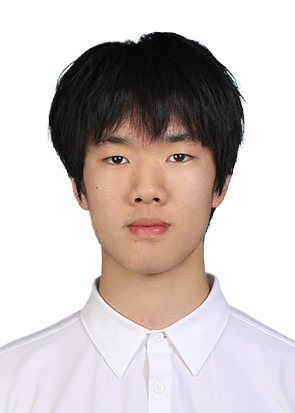

# 👋 Welcome to My User Page

## About Me
Hi! My name is **William Wang**, and I am a programmer interested in *AI* and *software development*. Currently I'm a third year student at UCSD majoring in Computer Science.

---

## 🧑‍💻 Programming Background
> "Code is like humor. When you have to explain it, it’s bad."

I have experience with:
- C/C++
- Python
- Git & GitHub

### Favorite Language
My favorite programming language is **C/C++**.

---

## 📸 Picture



---

## 🔗 Links

### External Link
Check out [GitHub](https://github.com)

### Section Link
Jump to [Programming Background](#-programming-background)

### Relative Link
Go to [README](README.md)

---

## 🧾 Code Example

Here is some sample code:

```python
def fibonacci(n):
    if n <= 1:
        return n
    return fibonacci(n-1) + fibonacci(n-2)

```

---

## Lists

### Unordered List
- Apple
- Banana
- Cherry

### Ordered List
1. Learn Git
2. Build Projects
3. Apply for Internships


### ✅ Task List
- [x] Learn Markdown
- [x] Create GitHub Repo
- [ ] Become a 10x programmer


### 🎨 Styling Text
- **Bold text**
- _Italic text_
- ~~Strikethrough~~